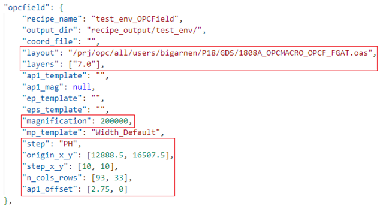

# User Guide
SEM Pro: Quick Recipe v0.3.0  
Last update: 15/10/2024

<!--
## Table of contents
1. [What is SPQR?](#what-is-spqr)  
    a. [Context and field of application](#context-and-field-of-application)  
    b. [Current advancement](#current-advancement)  
2. [Quick start](#quick-start)  
    a. [Configuration file generation](#configuration-file-generation)  
    b. [Recipe generation](#recipe-generation)   
3. [Coordinate file sources](#coordinate-file-sources)  
4. [Recipe configuration file](#recipe-configuration-file)  
    a. [Syntax and format](#syntax-and-format)  
    b. [Example of JSON configuration file](#example-of-json-configuration-file)  
    c. [User configuration file - Coordinate files](#recipe-configuration---coordinate-files)  
    d. [User configuration file - OPCField](#recipe-configuration---opcfield)    
5. [Commands](#commands)  
    a. [Init](#init)  
    b. [Build](#build)  
    c. [Edit](#edit)  
    d. [Upload](#upload)  
    e. [Test](#test)  
6. [FAQ](#faq)  
-->

## What is SPQR?

SEM Pro: Quick Recipe is meant to ease the process of CD-SEM recipe creation.

### Context and field of application

- **What is a SEM?** → A microscope
- **What is a SEM recipe?** → A file to execute instructions on a SEM
- **What is RCPD (Recipe Director)?** → A software to manage SEM recipe

SPQR takes different kinds of sources and is meant to need as minimum user interaction as possible. It produces a .csv file and a layout exported on Recipe Director.

### Current advancement

SPQR takes several types of coordinate sources for recipe creation:
- Genepy OPCField file (“ssfile”) → .csv
- OPCField matrix generation (no file)
- HSS file (recipe) → .csv
- Json file (recipe outputed from SPQR) → .json
- Calibre ruler files & clip files → .xml

These are specified in the configuration file (.json) needed to create a recipe 

Its outputs:
- A HSS recipe → .csv
- A JSON recipe → .json
- (optional) a measurement file (saved as `measure_<your_recipe_name>`) → .csv


## Quick start  

**What's needed to use SPQR**
- A recipe configuration file in JSON format following our internal structure and format
- A coordinate file (or OPCField case)

### Configuration file generation
Represented by the **`init`** command, generates either a generic configuration file for spqr, a coordinate file example or both. 
```bash
spqr init
```
```bash
usage: spqr init [-h] [-c CONFIG_FILE] [-x COORDINATE_FILE]

options:
  -h, --help            show this help message and exit
  -c CONFIG_FILE, --config_file CONFIG_FILE
                        Path (file or directory) to write a configuration file (JSON).
  -x COORDINATE_FILE, --coordinate_file COORDINATE_FILE
                        Path (file or directory) to write a generic coordinate file (genepy format).
```

### Recipe generation
The main command **`build`** generates a recipe from a configuration file.  

Example of build command usage:
```bash
spqr build -c ./my_config.json -r my_recipe1 --upload -m
```

```
usage: spqr build [-h] -c CONFIG [-r RECIPE] [-u] [-l RANGE [RANGE ...]] [-m]

Build a SEM recipe from a configuration file and coordinates. See `spqr init` command to get templates.

options:
  -h, --help            show this help message and exit
  -c CONFIG, --config CONFIG
                        Path to JSON configuration file containing the recipe parameters.
  -r RECIPE, --recipe RECIPE
                        Name of the recipe to run, from the JSON configuration file.
  -u, --upload_rcpd     Send HSS recipe (.csv) and layout to RecipeDirector machine.
  -l RANGE [RANGE ...], --line_select RANGE [RANGE ...]
                        Select range(s) of rows to include. Format: -l 50-60 150-160
  -m, --measure         Write the raw data measured from layout to recipe output directory
```


## Coordinate file sources 
1) OPCField matrix generation (OPCField Reverse)  
Actually not a coordinate file, you will need to input information about your OPCField in the [configuration file section](#recipe-configuration---opcfield)

2) Genepy OPCField file / "SSfile"  
Currently, only OPCfield field generated by Genepy or manually created ssfile (matching the Genepy format) are supported by the application. Please, conform to this format. **With tabulation separators.**  
You should, at least, have these columns names: `Name`, `X_coord_Pat`, `Y_coord_Pat`, `X_coord_Addr`, `Y_coord_Addr`.  
`UNIT_COORD` column is optional and defaults to `nm`. 

3) HSS file (Hitachi)   
These are CSV recipes that are meant to be reused as input for a new recipe.  
Currently, only coordinate information is used (EPS_Data section): EP Name, Move X/Y, AP1 X/Y. 

4) Calibre rulers  
Calibre ruler files are fully supported. You can select points manually in Calibre using the option "allow multiple rulers" and the “ruler palette” and export them in an XML file. The center of the rulers will be used for pattern coordinate, and the ruler comment for pattern name (more documentation coming soon).  

> **_NOTE:_**
Calibre rulers can have a `<comment>` section, which will be used as the name of the ruler. Otherwise, a generic name will be used.


5) JSON recipe  
Json recipes are also existing recipes meant to be input for a new recipe.  
These JSON recipes should come from SPQR output since they should match our internal structure.  
<!-- Currently, only coordinate information is used (EPS_Data section).  -->

## Recipe configuration file

This part is meant to explain the different possibilities of setting up a recipe configuration file in JSON. There are two main case flows:
- The case where a list of `coordinate source` (file) is provided
- The case of an `OPCField` (where coordinate matrix will be recreated).

<!-- > **_NOTE:_** -->
:::{note}
You can have parameters for several recipes in the same file, since we select a recipe for `build` with the `-r` flag.
:::

### Syntax and format

Your recipe configuration file must:
- always match JSON format (see below),
- use `""` (double quotation marks) for text values,
- use `.` (dot) for decimals and `,` (comma) are data separators,
- write all your coordinates and measurement values in `um`.

### JSON compliance

We advise users to use an IDE or a text editor that can check the validity of the JSON in real-time.  
SPQR will also assist in locating errors in JSON:
```
[ERROR] __main__ The file debug/fake.json contains invalid JSON:
        Expecting ',' delimiter: line 4 column 9 (char 69).
```
You can also use the UNIX command: `cat config.json | json_verify`
### Example of JSON configuration file

```json
{ 

    "opcfield_reverse": { 

        "recipe_name": "banger-X901A-GATE-etchbias", 

        "output_dir": "recipe_output/", 

        "coord_file": "", 

        "origin_x_y": [6216.487, 29885.021], 

        "step_x_y": [6, 8.4], 

        "n_cols_rows": [4, 12], 

        "layout": "/work/opc/all/users/banger/X90M/GATE/HERMES_MPW/X901A_FR_TOPRIGHT_ALL_cropped_for_SEM.oas", 

        "layers": ["0.400"], 

        "ap1_template": "OPC_AP1_template_45K", 

        "ap1_offset": [0.35, -4.4], 

        "ap1_mag": 45000, 

        "magnification": 200000, 

        "mp_template": "X90M_GATE_PH", 

        "step": ["PH", "ET"]

    }, 

    "coordinate_file": { 

        "recipe_name": "banger_X901A", 

        "output_dir": "recipe_output/", 

        "coord_file": "/work/opc/all/users/banger/X90M/GATE/HERMES_MPW/SJ71_X901A_GATE_OPCVERIF_FEM_PH2.csv", 

        "layout": "/work/opc/all/users/banger/X90M/GATE/HERMES_MPW/X901A_FR_TOPRIGHT_ALL_cropped_for_SEM.oas", 

        "layers": ["13.0"], 

        "ap1_template": "", 

        "ap1_mag": 45000, 

        "ap1_offset": [0.35, -4.4], 

        "ep_template": "", 

        "eps_template": "", 

        "magnification": 200000, 

        "mp_template": "X90M_GATE_PH", 

        "step": "PH", 

    } 

} 
```
<!-- Also find it here: <mark>example_config.json</mark> -->
For convenience, use [spqr init](#init) to generate an up-to-date template of configuration file in your working directory.

### Recipe configuration - Coordinate files

The following values are always mandatory: 
- **layout** database (OASIS or GDSII) → `file path`
- **layers** → a `list of string`: in the format ["13.0"] or ["13.0", "13.31"].  
At least one _layer.datatype_ member is required. The first _layer.datatype_ is used as the target and will be measured in the layout. This layer will also populate the IDD layer mapping with standard RET datatypes (.4 .31 ...) for visible and reference layers.  
- **magnification** → an `integer`  
It overrides the magnification set in the AMP template.
- **step** a `string` or `list of string`. `PH` (litho), `ET` (etch) or `PH_HR`/`ET_HR` for high resolution  
If a list is provided, like `["PH", "ET"]`, several recipes will be generated with corresponding SEM condition, # of frames, and target layer.
- **coord_file** → a `Path`  
(depends on the type of recipe you make; coordinate file recipes opposed to opcfield matricing recipes)

The mandatory values of a coordinate file parsing are visually represented by the following red boxes:  


What is optional / non-mandatory (line can be removed or value left empty `""`): 
- **recipe_name** → a `string` 
(if none, recipe_name will be set to “recipe”) 
- **output_dir** → a `Path` (can be relative depending on the folder from where you run the CLI app)  
(if none, output_dir will be set under “/recipe_output” in the project’s architecture)  
- **mp_template** → 3 possibilities:  
    1) empty (default: Width_Default template from Recipe Director)
    2) a single MP template name → `string`  
    3) two MP templates for Line and Space → `dictionary of string`  
    _format:_ {"line": "MP_template_line", "space": "MP_template_space"}
- **ap1_template** → a `string` 
- **ap1_mag** → an `int`  (it overrides the magnification set in the AP1 template.)
- **ap1_offset** → a `list of float` (um) 
Relative value in um from the pattern coordinates to the addressing pattern. 
- **ep_template** → a `string`  
By default, a 16 frame template will be used for `PH`|`PH_HR` steps or 32 frames for `ET`|`ET_HR` steps. Use this option only to override this behaviour.
- **eps_template** → a `string` (default value: “EPS_Default”)  

For a coordinate file parsing (non-opcfield) the mandatory values are showed in blue squares:  


### Recipe configuration - OPCField

For OPCField matricing, `coord_file` field must be left empty and additional opcfield parameters are required in your JSON configuration file.

For OPCField recipes (opposed to file-based recipes), 6 numerical values are mandatory in order to recreate the structure of the matrix.

- **origin_x/y**: coordinates of the center of the pattern on the bottom left corner → `list of float` (um)
- **step_x/y**: distance of a period, distance of a pattern to another → `list of float` (um)
- **n_cols/rows**: number of rows and columns of patterns in the opcfield → `list of int`

In the case of an OPCField, here are the mandatory values (red boxes):  


## Commands

> **_NOTE:_**
You can have help for your CLI usage with `-h/--help` attribute.  
Example (same thing for every command) `spqr -h`, `spqr build -h`

### Init
Creates either a configuration file template for spqr, a generic coordinate file, or both.  
This command can be launched without argument, one of them two or both.
```console
$ spqr init
spqr_init/
├── default_config.json
├── default_coord_file.txt
└── recipe_output/
```
> **_NOTE:_**
Both commands will either generate a default file if a directory path is inputted as argument, or create a file with given name if a file path is inputted as argument

It takes 2 optional arguments:

- `-c`, `--config_file`  
Takes a file or directory path.  
Creates a configuration file (JSON format) at the destination.  
Example: `spqr init -c ./working_dir/config.json` or `spqr init -c ./working_dir/`
- `-x`, `--coordinate_file`  
Takes a file or directory path  
Creates a generic coordinate file (genepy format) at the destination.  
Example: `spqr init -x ./working_dir/config.json` or `spqr init -x ./working_dir/`

> **_NOTE:_**
By default, files are located in the current directory where you are running the command

### Build

This is the main command to generate a recipe based on the configuration file.  
This command should be launched, at least, with `-c` / `--config` argument.

It takes 5 options:

1) You are forced to use the `-c` / `--config` attribute since it should point to the file path where your recipe parameters are stored. The app manages if one or more recipes are stored in the file. It works without `-r` / `--recipe` only if one recipe is in the configuration file.  
Example: `spqr build -c /path/to/conf_file.json`  

2) As soon as you have 2 recipes parameters stored in your `-c` file, you will need to define the `-r` / `--recipe` argument (to know which recipe config to launch). That is why this attribute is optional.  
The name provided here should match the key to the dictionary referenced in your configuration file. Corresponding to your recipe with all its parameters in the curly brackets (pairs of key-value).  
Example: `spqr build -c /path/to/conf_file.json -r P18_FGAT`

3) The `-l` / `--line_select` attribute allows user to create a recipe based on one or more intervals.  
For example, if you want to select only the measurement points 50 to 60 (both included) you will need to write `-l 50-60`. If you want to add 70 to 80 you must write `-l 50-60 70-80`.  
Minimal example: `spqr build -c /path/to/conf_file.json -l 50-60`  

4) The `-m` / `--measure` attribute allows user to export the measurements from  the layout as a CSV file in the same directory as the exported recipe.  
Minimal example: `spqr build -c /path/to/conf_file.json -m`

5) The `-u` / `--upload_rcpd` attribute allows user to upload the recipe created and the layout to RCPD.  
Minimal example: `spqr build -c /path/to/conf_file.json -u`  

To sum up, you will at least use: 
```bash
spqr build -c path/to/config/file.json
```

All the other attributes (`-r`, `-l`, `-m` and `-u`) are optional and can be combined to the others in no particular order.  
As example: 
```bash
spqr build -c ./file.json -r my_recipe -l 50-60 70-80 -m -u
```

> **_NOTE:_**
The `-r` argument should match recipe name flagged in your json configuration file.  
Using the example above, `my_recipe` should be a name of recipe at the root level of `./file.json` 

### Edit

The edit commands can help the user modify a recipe on the fly. You can edit columns iterativelly in CLI by interaction. Editing columns in a specific row or the whole column.  
This command should be launched with all three arguments (`-r`, `-c` and `-n`).

We note 3 subcommands :  
- `-r`, `--recipe_file`  
Taking path of the HSS recipe to modify (.csv).  
Gets the recipe to edit.
- `-c`, `--config_file`  
Taking path of the user configuration file to modify (.json).  
Gets info of previously generated recipe / recipe you want to make.
- `-n`, `--recipe_name`  
Takes a string name of the recipe to edit (from config file).    
Selets the recipe within the configuration file.  

Example: `spqr edit -r /path/to/recipe.csv -c ../path/to/config_file.json -n config_recipe_name`

> **_NOTE:_**
Each change on the recipe will have an impact on the naming of the edited recipe outputed (based on all the recipes in the folder). Adding one to the recipe version to differentiate them. If the given recipe name is `recipe_name.csv` outputed name will be `recipe_name_1.csv`.

### Upload

The upload commands ease the sending process to RecipeDirector machine (remote) for layouts or recipes.
This command should be launched with one or two arguments (`-r` or `-l`).

> **_NOTE:_**
Beware what you upload as well as the size of files and their quantity.

It takes 2 options:  
- `-r`, `--recipe`  
Takes the path to a recipe.  
Uploads the given recipe to RecipeDirector.  
Example: `spqr upload -r /path/to/your/recipe.csv`
- `-l`, `--layout`  
Takes the path to a layout.
Uploads the given layout to RecipeDirector with adequate file permissions.  
Example: `spqr upload -l /path/to/your/layout.gds`

### Test
Originally intended for development purposes, the test command can help detect bugs in the recipe generation.

> **_NOTE:_**
The test command generates files from pre-defined configuration files.

We note 2 subcommands :  
- `-r` / `--recipe`  
Taking arguments from `genepy`, `calibre_rulers`, `opcfield`, `csv` or `json`.  
Runs the selected recipe type in testing mode.  
Example: ```spqr test -r calibre_rulers```

- `-a`, `--all_recipes`  
Taking no arguments.  
Runs all (genepy,calibre_rulers,opcfield,csv,json) recipe types in testing mode.  
Example: ```spqr test -a```

## FAQ

**Can SPQR always make recipes like I would like to?**  
→ No, but it can help you gain time. Its goal is to cover the most generic usage of SEM recipe creation.